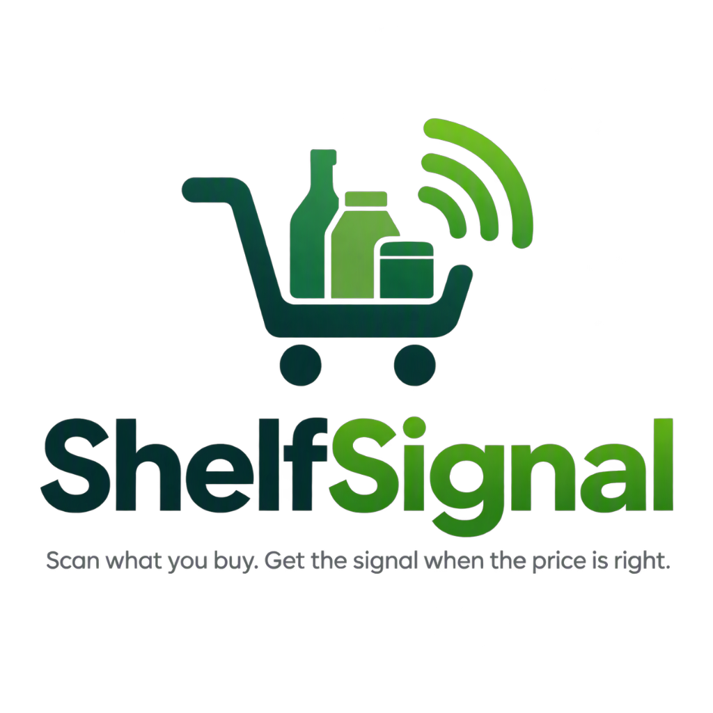

<p align="center">
  
</p>

<h1 align="center">ShelfSignal</h1>

<p align="center">
  <strong>Scan what you buy. Get the signal when the price is right.</strong><br/>
  Premium iOS &amp; Android price monitoring for Australian households.
</p>

## Project Structure

```
ShelfSignal/
├── mobile/          # Flutter iOS & Android app (Riverpod + GoRouter)
├── backend/         # Express + PostgreSQL API with signal engine
├── admin/           # Next.js admin portal (scaffolded later)
├── shared/          # Shared types/API contracts (planned)
└── Docs/            # Master Prompt, backlog, ADRs
```

## The Shelf-to-Signal Loop

1. **Scan the shelf** — enter/scan a barcode (GS1-validated)
2. **Confirm the match** — canonical product identity, verification status
3. **Set the signal** — target price / discount % / near-low / any drop
4. **ShelfSignal watches** — append-only price observations per retailer
5. **Receive a meaningful alert** — explainable: what, where, why, how confident
6. **Act or snooze** — mark bought, dismiss, snooze, adjust the rule

## Quick Start

### Backend

```bash
cd backend
npm install
docker-compose up -d postgres   # local PostgreSQL
cp .env.example .env            # defaults match docker-compose
npm run migrate:seed            # schema + fixture data
npm run dev                     # http://localhost:3000
npm test                        # 52 tests, no database needed
```

### Mobile

```bash
cd mobile
flutter pub get
flutter run                     # demo mode: full loop, no backend needed
flutter analyze && flutter test
```

The app starts in **demo mode** (clearly labelled) using the same fixtures as
the backend seed. To go live: run the backend, then set the API base URL in
Profile → and toggle demo mode off.

## Documentation

- [Docs/Master Prompt.md](Docs/Master%20Prompt.md) — product & technical spec
- [Docs/implementation-backlog.md](Docs/implementation-backlog.md) — prioritised backlog
- [Docs/architecture-decisions.md](Docs/architecture-decisions.md) — ADRs
- [CHANGELOG.md](CHANGELOG.md) — rolling changelog

## Principles (from the spec)

- Exact product identity: barcode-first, pack-size aware, canonical product ≠ listing
- A signal, not just a drop: every alert explains its trigger and shows freshness
- No live prices without evidence: fixtures until a lawful retailer pathway exists
- Privacy: cascade account deletion, minimal collection, no secrets in source

## License

© 2026 ShelfSignal. All rights reserved.
